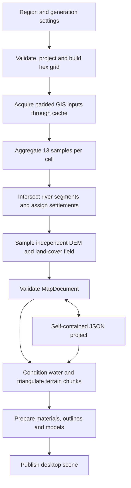
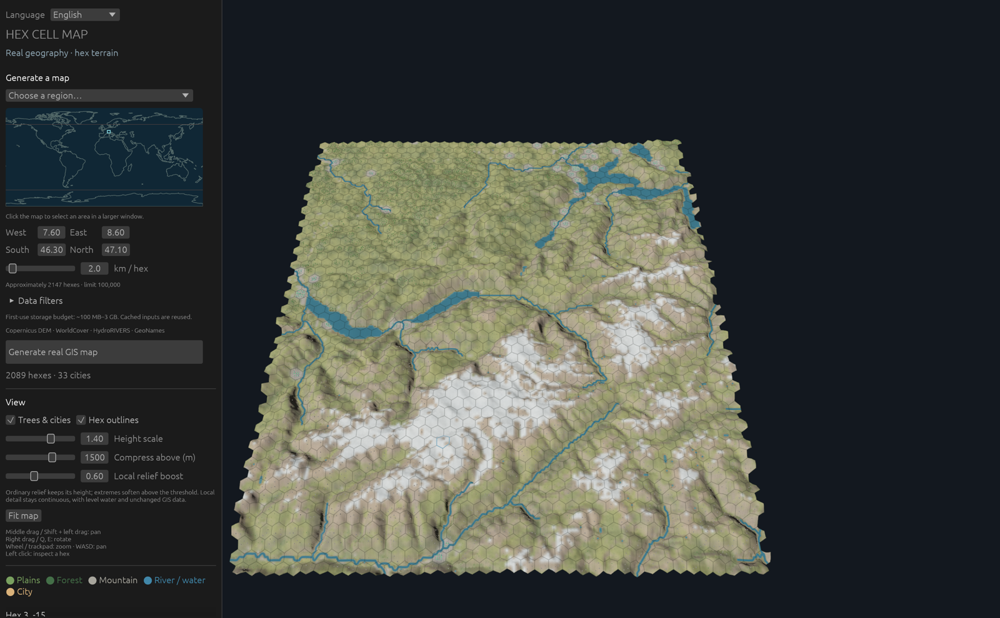
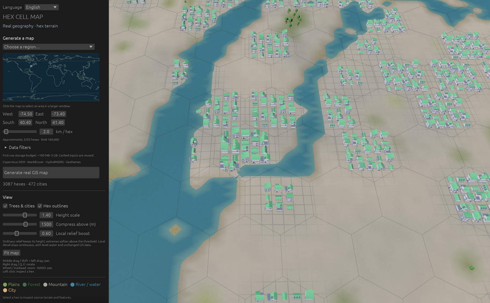

# Data pipeline and core algorithm

[简体中文](data-pipeline.zh-CN.md) · [README](../README.md) · [Validation](validation.md)

Hex Cell Map turns a geographic rectangle into an editable hex map and a continuous 3D terrain surface. GIS processing runs locally. The authoritative result is a `MapDocument`; meshes, materials, outlines and model instances are derived from it.

This document describes the implemented pipeline. The [roadmap](roadmap.md) covers planned work, and [data notices](../NOTICE.md) cover attribution and distribution requirements.

## From selected region to scene



The desktop runs acquisition and scene preparation on a background worker. It replaces the displayed document and scene only after preparation succeeds and the job revision is current. Cancellation, failed input acquisition and stale results leave the current map available.



*Alps, 7.6–8.6° E / 46.3–47.1° N, with 2 km spacing and 2,089 cells. Hex outlines follow the continuous terrain rather than forming flat tile tops. Screenshots were captured from the native application on macOS Apple Silicon.*

## Inputs and cache

| Layer | Input | Acquisition and use |
| --- | --- | --- |
| Elevation | Copernicus DEM GLO-90, AWS COG mirror | Download the tile list, discover intersecting 1° tiles, and read bounded GeoTIFF windows through GDAL HTTPS range requests. |
| Land cover | ESA WorldCover 2021 v200 | Discover intersecting 3° COG tiles. Class codes drive cell fractions, source water masks and terrain materials. |
| Rivers | HydroRIVERS v1.0 | Cache continental shapefile ZIPs, extract the shapefile components, apply a geographic spatial filter, and retain reaches meeting the discharge threshold. |
| Settlements | GeoNames `cities1000.zip` | Cache the global archive, parse its records, and filter by the selected rectangle and minimum population. |
| Region selector | Bundled Natural Earth land outlines | Draw the overview map used to choose a region. These outlines do not supply generated terrain. |

Raster and river acquisition include a margin of approximately three hex spacings, adjusted for latitude. This covers boundary cells and nearby surface samples. Settlements are filtered against the original selection.

Let `s` be the distance between neighboring hex centers in meters. Raster windows target `s / 8` resolution, bounded by the available source pixels. GDAL averages DEM pixels and uses nearest-neighbor resampling for categorical land cover. Thus, the native source resolution is not the generated surface resolution; at 2 km spacing, the requested raster resolution is approximately 250 m.

The cache separates reusable downloads from processed raster windows:

- Archives and the DEM tile list are reused when a nonempty cached file exists. HTTP metadata preserves the source URL, acquisition time and available ETag; reuse does not automatically refresh a daily GeoNames snapshot.
- Raster JSON keys hash the processing tag `raster-window-v2`, source URL, padded region and requested resolution. Changing those inputs selects different windows.
- Each `SourceRecord` stores the dataset name/version, URL, license, attribution, acquisition timestamp, optional ETag and SHA-256. Raster hashes cover the acquired `f32` sample bytes, while vector hashes cover their downloaded archives. Raster ETags are currently absent.
- Downloads and cache JSON are published from temporary files. Archive downloads have bounded retries and cancellation checks; raster reads also check cancellation through a GDAL progress callback.

Storage defaults to the platform cache directory under `hex-cell-map`. Set `HEX_MAP_CACHE_DIR`, or use probe `--cache DIR`, to select another location. A matching, complete cache can support generation offline. A saved project can reopen offline without GIS caches.

Missing land elevation, missing land cover, unknown cover classes and unavailable required downloads fail generation. The explicit DEM exception is a sample identified as WorldCover permanent water (`80`), which may use 0 m when DEM coverage is absent.

## Projection and hex coverage

`Projection` transforms WGS84 longitude/latitude into a local azimuthal equidistant coordinate system centered on the selection. Geographic input order is explicitly longitude, latitude. GIS geometry uses `f64` coordinates in meters; the document retains the projection WKT.

Generation enforces these limits together:

| Constraint | Limit |
| --- | --- |
| Center spacing | 1–20 km |
| Selected latitude | −60° to +60° |
| Projected width or height | At most 1,000 km |
| Number of cells | At most 100,000 |
| Continuous source field | At most 2,000,000 samples |
| Geographic bounds | West < east, south < north; no antimeridian crossing, including padded boundary coverage |

For axial hex coordinates `(q, r)`, the center and circumradius are:

```text
x = s × (q + r / 2)
y = s × sqrt(3) / 2 × r
R = s / sqrt(3)
```

The selected rectangle is densified with 32 segments per edge and projected into a polygon. Grid construction enumerates candidate rows and columns and retains every hex polygon intersecting that selection, including boundary hexes whose centers lie outside it. Cells receive dense IDs in row/column order, and `id` matches the cell's index in `MapDocument.cells`.

Point assignment applies the inverse center equations, converts to cube coordinates `(q, r, −q−r)`, rounds all three, and corrects the coordinate with the largest rounding error. This gives a deterministic containing hex for a settlement. Canonical integer corner keys make neighboring hexes share the same geometric corners.

## Cell aggregation and classification

Each hex uses 13 deterministic interior positions: its center and two six-point rings at `0.4 R` and `0.82 R`. The positions are transformed back into WGS84 and sampled from the processed raster windows. Cell aggregation uses nearest samples from those windows; their DEM values have already been averaged during acquisition.

For sample elevations `h[i]`, compute:

```text
generated_elevation_m = mean(h)
elevation_m           = generated_elevation_m initially
relief_m              = max(h) − min(h)
slope_degrees         = degrees(atan(relief_m / (1.64 × R)))
forest_fraction       = count(class 10 or 95) / 13
water_fraction        = count(class 80) / 13
```

The slope is a cell-scale estimate from sampled relief, not an average of per-pixel DEM slopes. Fractions are sample proportions, not exact polygon area measurements.

Landscape classification checks mountain first, then forest, then plains:

| Classification | Rule | Default threshold |
| --- | --- | --- |
| Mountain | Relief **or** estimated slope meets its threshold | 300 m or 15° |
| Forest | Forest fraction meets its threshold, after the mountain check | 0.4 |
| Plains | Neither rule above applies | — |
| Open-water surface | Water fraction ≥ 0.5 | Fixed majority rule |

Landscape and surface are separate fields. A mountain can carry a river or an urban feature without losing its landscape classification.

## Rivers and settlements

The logical river algorithm processes every consecutive pair of source polyline points. It narrows candidate hexes using the segment's bounding box, then tests exact line–hex-polygon intersections. Every intersected cell receives the reach ID, with sorted, deduplicated IDs. This follows source geometry through complete cells rather than sampling only the river's vertices.

An intersected cell becomes `Surface::River` unless it is already `Surface::Water`. Open water keeps its surface classification and still retains the river ID. The document preserves both projected river polylines and network records containing `id`, `next_down`, discharge and stream order. The default minimum discharge is 5 m³/s.

Settlements are projected and assigned to their containing hex with cube rounding. Each cell retains all assigned GeoNames records, sorted by source ID. The default minimum population is 5,000. A cell with settlements receives `UrbanTerrain` with their summed population and `Mixed` style; only a `Land` surface changes to `City`. River and water surfaces keep their identities.

Urban edits update the cell's urban feature and surface where applicable. Source settlement records remain attached to their original cell, and buildings in a river cell can occupy its dry portions.



*Hudson, 74.5–73.4° W / 40.4–41.4° N, at 2 km spacing, focused on hex `(4, −12)` from a 12 km camera distance. Urban coverage, water geometry and logical hex boundaries coexist. Channel widths and building sizes are symbolic at this scale.*

## Continuous terrain and water

The rendered terrain has its own regular projected `HeightField`, independent of the 13 cell samples. Its step is `s / 4` (500 m at 2 km spacing), and its bounds cover all generated hexes plus a sample margin. Elevations use bilinear sampling across processed raster windows and are stored as `f32`; land-cover codes use nearest samples. Terrain vertices then bilinearly sample this field. Material weights interpolate the indicators for its 11 land-cover classes.

The surface also supports smooth interpolation of cell elevation offsets (`elevation_m − generated_elevation_m`) with a compact neighborhood kernel. General elevation brushes remain planned; the existing desktop editing workflow exposes urban cells and display-height settings.

Water geometry is derived separately from logical surface labels:

1. **Open-water bodies.** Find four-connected components of source-field class `80`. Start each body at its median sampled DEM height plus the mean cell edit offset. Reject shoreline samples more than 15 m from that median. Soften mask coverage and refine the 0.5 coverage contour near shores while keeping body interiors level.
2. **Channels.** Orient each reach using its downstream connection, falling back to endpoint elevations when that connection is unavailable. Smooth the source line with bounded deviation, resample it, and initialize water heights from local cross-section minima. The symbolic half-width is `clamp(0.075 s + 3.5 sqrt(discharge), 0.08 s, 0.18 s)`.
3. **Level conditioning.** Build a graph of channel samples and connected water bodies. A priority queue lowers heights to satisfy downstream and slope constraints. Nearby overlapping channel footprints receive additional links; one graph node per water body makes a crossing adjust the complete body together.
4. **Beds and banks.** Lower derived ground below conditioned water and blend bank ramps into nearby terrain. Source DEM samples and generated cell elevations retain their original values.

This is geometry and water-level conditioning for visualization; the application does not simulate water flow. The source field can contain a lake in a cell whose 13 samples did not give it a majority-water label.

## Triangulation, seams and picking

Terrain starts with six triangular sectors per hex, each subdivided four times along its edges: 96 base triangles per cell. Water and bank detail add vertices and constraints to a local constrained Delaunay triangulation.

The mesh algorithm clips water polygons to cells, unions overlapping footprints, and uses the union's exterior and interior rings as constraints. Land beds and water surfaces share the refined planar triangulation. Water triangles are emitted only where a face centroid lies inside the union, so bends and lake crossings produce a single surface footprint.

To keep adjoining cells and chunks connected, vertices use integer keys in a normalized hex basis with `1,000,000` key units per corner-key unit. Shared edges collect subdivisions and water/bank intersections before triangulation. Boundary vertices are snapped to their canonical edge, and adjacent cells use the same complete boundary chain. Shared positions and normals are evaluated from the same source and hydrology functions.

Cells are grouped into `32 × 32` axial chunks using Euclidean division, including negative coordinates. Each rendered triangle records its owning cell ID. Mesh ray casting uses the hit triangle index to look up that ID, so terrain refinement preserves hex picking. Grid outlines reuse the boundary chains and cached shared edges.

## Display heights and scene assets

The base display transform scales ordinary elevations linearly and compresses extreme absolute elevations logarithmically. For elevation `h`, scale `a` and compression threshold `T`:

```text
display(h) = sign(h) × a × |h|                      when |h| ≤ T
display(h) = sign(h) × a × T × (1 + ln(|h| / T))    otherwise
```

Defaults are `a = 1.4`, `T = 1,500 m` and local-relief boost `0.6`. Local detail is measured against a weighted nine-sample baseline approximately `1.5 s` away. Its enhancement is bounded with `tanh`, reduced in high-relief terrain and suppressed near water. Cached height samples let the desktop update positions and normals immediately when display settings change, including water, outlines and model anchors.

Bevy coordinates use kilometers: projected `(x, y)` maps to world `(x / 1000, display_height / 1000, −y / 1000)`. The coordinate conversion and height controls affect presentation, while GIS elevations remain in meters.

Land-cover weights, uncompressed source slope, bank moisture and urban coverage drive terrain colors and grass/soil/gravel/rock materials. Snow comes from the source snow/ice class rather than an altitude-only rule. Imported Kenney models and Poly Haven textures provide the visual assets; see [art assets](art-assets.md). Placement is deterministic, trees are limited to forest land cells without urban coverage, and buildings use dry ground within urban cells. These model instances are derived scenery, not surveyed building footprints.

## Persistence, parallelism and verification

Schema `2`, with generator tag `gis-hex-v3`, stores settings, projection WKT, cell statistics and edits, provenance, the height/cover field, river network and polylines, and display settings. The hex lookup index is rebuilt on load. Meshes, Bevy entities and acquisition caches are excluded. Project saving writes and syncs a temporary file beside the destination, keeps an existing file as `.hexmap.bak`, and replaces the destination. Loading validates the schema, fields and canonical cell IDs before scene preparation.

A shared Rayon pool parallelizes raster acquisition, cell and source-field sampling, water footprint unions, and chunk construction. Raster acquisition allows at most four active tile reads. Each GIS sampling worker owns its coordinate transform, and each tile task opens its own GDAL dataset. Indexed results preserve tile, cell and chunk order. `RAYON_NUM_THREADS` controls worker count; existing regression checks compare one and four workers exactly.

The probe checks settlement containment, river-cell connectivity and repeatable canonical data. `--audit-raster` compares processed windows against independent GDAL RasterIO within 0.001; `--audit-terrain` checks topology, finite geometry, shared positions/normals and water normals. Native smoke captures additionally verify imported art and terrain picking. Measured results and remaining platform/performance gates are in [validation](validation.md).

To reproduce the screenshots from the repository root, build the binaries and generate the probe documents first:

```sh
cargo build --locked --bins
./target/debug/gis-probe --region alps --repeat --audit-raster --audit-terrain --output target/validation/alps.json
./target/debug/gis-probe --region hudson --repeat --audit-raster --audit-terrain --output target/validation/hudson.json
./target/debug/hex-cell-map --lang en --preview target/validation/alps.json --smoke --outlines --screenshot target/validation/pipeline-alps-en.png
./target/debug/hex-cell-map --lang en --preview target/validation/hudson.json --smoke --outlines --focus 4 -12 --distance 12 --screenshot target/validation/pipeline-hudson-en.png
```

Replace `--lang en` with `--lang zh-CN` for the translated interface. Run the desktop commands in a native graphical session. A successful capture produces a PNG and logs `SMOKE: native frame captured`. Documentation images in `docs/images/` are resized copies of those native captures.

## Code guide

| Module | Responsibility |
| --- | --- |
| [`map_core.rs`](../src/map_core.rs) | Settings, projection, hex geometry, authoritative records and validation |
| [`gis/cache.rs`](../src/gis/cache.rs) | Downloads, cache keys, HTTP metadata and provenance hashes |
| [`gis/raster.rs`](../src/gis/raster.rs) | Raster discovery, bounded reads, resampling and source sampling |
| [`gis/vectors.rs`](../src/gis/vectors.rs) | HydroRIVERS and GeoNames acquisition/filtering |
| [`generation.rs`](../src/generation.rs) | Cell aggregation, river intersections, city assignment and source field |
| [`hydrology.rs`](../src/hydrology.rs) | Source-mask water bodies, channel geometry and level conditioning |
| [`elevation.rs`](../src/elevation.rs) | Local-relief metadata and display-height/normal evaluation |
| [`terrain.rs`](../src/terrain.rs) | Water unions, constrained meshes, shared boundaries and triangle ownership |
| [`desktop/mod.rs`](../src/desktop/mod.rs), [`desktop/scene.rs`](../src/desktop/scene.rs) | Background jobs, edits, model preparation, scene publication and picking |
| [`project.rs`](../src/project.rs), [`jobs.rs`](../src/jobs.rs) | Snapshot persistence, progress and cancellation |
