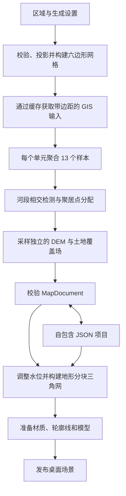
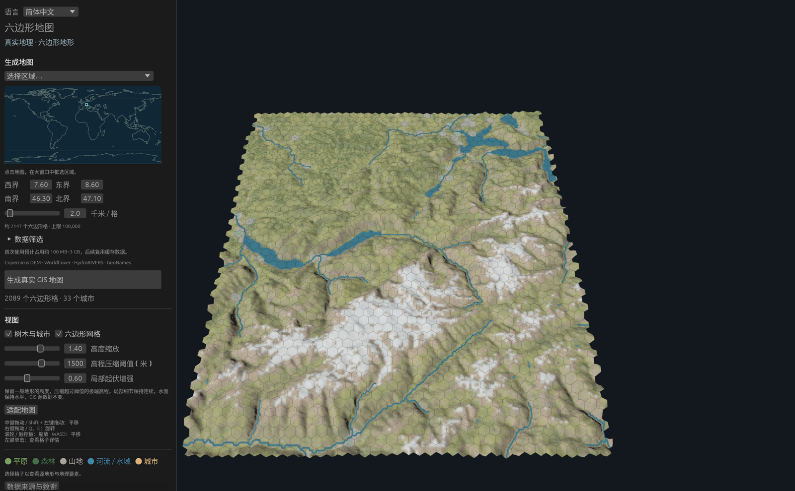
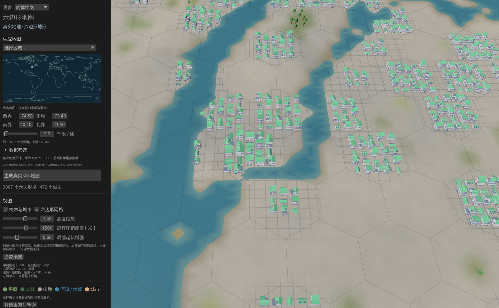

# 数据流水线与核心算法

[English](data-pipeline.md) · [README](../README.md) · [验证结果](validation.md)

Hex Cell Map 将用户选择的地理矩形转换为可编辑的六边形地图和连续的三维地形表面。GIS 数据处理在本地运行。`MapDocument` 是地图的权威数据；网格、材质、轮廓线和模型实例都由它派生。

本文介绍已实现的流水线。[路线图](roadmap.md) 介绍计划中的工作，[数据声明](../NOTICE.md) 说明署名与分发要求。

## 从选定区域到三维场景



桌面应用通过后台工作线程获取数据并准备场景。只有准备成功且任务版本仍为当前版本时，才替换显示中的文档和场景。取消操作、输入获取失败或过期任务结果都会保留当前地图。



*阿尔卑斯区域，东经 7.6–8.6°、北纬 46.3–47.1°，间距 2 km，共 2,089 个单元。六边形轮廓贴合连续地形，不会形成平坦的瓦片顶面。截图来自 macOS Apple Silicon 上运行的原生应用。*

## 输入与缓存

| 图层 | 输入 | 获取方式与用途 |
| --- | --- | --- |
| 高程 | Copernicus DEM GLO-90，AWS COG 镜像 | 下载瓦片列表，查找相交的 1° 瓦片，通过 GDAL HTTPS 范围请求读取有界 GeoTIFF 窗口。 |
| 土地覆盖 | ESA WorldCover 2021 v200 | 查找相交的 3° COG 瓦片。类别编码用于单元覆盖比例、水体源掩膜和地形材质。 |
| 河流 | HydroRIVERS v1.0 | 缓存各大洲的 shapefile ZIP，提取 shapefile 组件，按地理范围过滤，并保留达到流量阈值的河段。 |
| 聚居点 | GeoNames `cities1000.zip` | 缓存全球档案，解析记录，按选定矩形和最低人口过滤。 |
| 区域选择器 | 内置 Natural Earth 陆地轮廓 | 绘制选择区域用的概览地图，不用于生成详细地形。 |

栅格和河流数据的获取范围包含约三个六边形间距的边距，并根据纬度调整，以覆盖边界单元和附近的地表样本。聚居点按原始选择范围过滤。

设 `s` 为相邻六边形中心之间的距离，单位为米。栅格窗口的目标分辨率为 `s / 8`，且不会超出可用源像素的分辨率。GDAL 对 DEM 像素取平均，对分类土地覆盖采用最近邻重采样。因此，源数据的原始分辨率不等于生成表面的分辨率；间距为 2 km 时，请求的栅格分辨率约为 250 m。

缓存将可复用下载文件与处理后的栅格窗口分开存储：

- 只要已有非空缓存文件，就复用档案和 DEM 瓦片列表。HTTP 元数据保留源 URL、获取时间及可用的 ETag；复用缓存不会自动刷新每日更新的 GeoNames 快照。
- 栅格 JSON 的键由处理标识 `raster-window-v2`、源 URL、扩展区域和请求分辨率的哈希组成。改变这些输入会使用不同的窗口。
- 每条 `SourceRecord` 保存数据集名称与版本、URL、许可证、署名、获取时间戳、可选 ETag 和 SHA-256。栅格哈希覆盖已获取的 `f32` 样本字节，矢量哈希覆盖下载的档案。当前栅格记录不包含 ETag。
- 下载文件和缓存 JSON 均通过临时文件发布。档案下载具有有限重试次数和取消检查；栅格读取也通过 GDAL 进度回调检查取消状态。

默认存储位置是平台缓存目录下的 `hex-cell-map`。设置 `HEX_MAP_CACHE_DIR`，或在探针中使用 `--cache DIR`，即可指定其他位置。完整且匹配的缓存支持离线生成。已保存的项目无需 GIS 缓存即可离线重新打开。

陆地高程缺失、土地覆盖缺失、覆盖类别未知或必需下载不可用时，生成会失败。DEM 的明确例外是 WorldCover 标识为永久水体（`80`）的样本：缺少 DEM 覆盖时，该样本可以使用 0 m。

## 投影与六边形覆盖

`Projection` 将 WGS84 经纬度转换为以选定区域中心为原点的局部方位等距坐标系。地理输入顺序明确为经度、纬度。GIS 几何使用以米为单位的 `f64` 坐标；文档保存投影 WKT。

生成时同时执行以下限制：

| 约束 | 限制 |
| --- | --- |
| 中心间距 | 1–20 km |
| 选定区域纬度 | −60° 至 +60° |
| 投影后的宽度或高度 | 不超过 1,000 km |
| 单元数量 | 不超过 100,000 |
| 连续源数据场 | 不超过 2,000,000 个样本 |
| 地理边界 | 西界 < 东界，南界 < 北界；包含边距在内的边界覆盖不得跨越反子午线 |

对于轴向六边形坐标 `(q, r)`，中心位置与外接圆半径为：

```text
x = s × (q + r / 2)
y = s × sqrt(3) / 2 × r
R = s / sqrt(3)
```

选定矩形的每条边划分为 32 段，再投影为多边形。网格构建枚举候选行列，保留所有与选区相交的六边形，包括中心位于选区外的边界单元。单元按行列顺序获得连续 ID，`id` 等于其在 `MapDocument.cells` 中的索引。

点归属计算先应用中心公式的逆变换，再转换为立方体坐标 `(q, r, −q−r)`，将三个坐标取整，并修正舍入误差最大的坐标。这使聚居点能够确定性地归属到其所在的六边形。规范化整数角点键保证相邻六边形共享相同的几何角点。

## 单元聚合与分类

每个六边形使用 13 个固定的内部采样位置：中心点，以及半径为 `0.4 R` 和 `0.82 R` 的两组六点环。将这些位置逆变换回 WGS84 后，从处理后的栅格窗口采样。单元聚合使用窗口中的最近样本；窗口内的 DEM 值已经在获取阶段经过平均重采样。

对于样本高程 `h[i]`，计算如下：

```text
generated_elevation_m = mean(h)
elevation_m           = 初始时等于 generated_elevation_m
relief_m              = max(h) − min(h)
slope_degrees         = degrees(atan(relief_m / (1.64 × R)))
forest_fraction       = 类别为 10 或 95 的样本数 / 13
water_fraction        = 类别为 80 的样本数 / 13
```

坡度是根据采样起伏估计的单元尺度值，并非逐像素 DEM 坡度的平均值。覆盖比例是样本占比，并非精确的多边形面积比例。

景观分类依次检查山地、森林和平原：

| 分类 | 规则 | 默认阈值 |
| --- | --- | --- |
| 山地 | 起伏**或**估计坡度达到对应阈值 | 300 m 或 15° |
| 森林 | 未满足山地条件，且森林比例达到阈值 | 0.4 |
| 平原 | 不满足以上规则 | — |
| 开阔水面类型 | 水体比例 ≥ 0.5 | 固定的多数规则 |

景观与地表类型是独立字段。山地可以同时包含河流或城市特征，而不会丢失其景观分类。

## 河流与聚居点

逻辑河流算法处理源折线中每一对连续点。首先利用线段包围盒缩小候选六边形范围，再执行精确的线段与六边形多边形相交检测。所有相交单元都会记录该河段 ID，并对 ID 排序、去重。算法依据源几何穿过的完整单元分配河流，不只采样河流顶点。

相交单元会变为 `Surface::River`，但已有的 `Surface::Water` 会保留。开阔水面保持其地表类型，同时记录河流 ID。文档既保存投影后的河流折线，也保存包含 `id`、`next_down`、流量和河流级别的网络记录。默认最低流量为 5 m³/s。

聚居点经投影后，使用立方体坐标取整归属到其所在单元。每个单元保留全部 GeoNames 记录，并按源 ID 排序。默认最低人口为 5,000。有聚居点的单元会获得 `UrbanTerrain`，人口为各记录之和，风格为 `Mixed`；只有 `Land` 地表会变为 `City`。河流和水面保留原有类型。

城市编辑更新单元的城市特征，并在适用时更新地表类型。源聚居点记录仍附着于原来的单元，河流单元中的建筑可以布置在干燥区域。



*哈德逊区域，西经 74.5–73.4°、北纬 40.4–41.4°，间距 2 km，相机聚焦六边形 `(4, −12)`，距离 12 km。城市覆盖、水体几何与逻辑六边形边界同时存在。在此尺度下，河道宽度与建筑尺寸为示意性表达。*

## 连续地形与水体

渲染地形使用独立的规则投影 `HeightField`，与每个单元的 13 个样本分开。其步长为 `s / 4`（间距 2 km 时为 500 m），范围覆盖全部生成的六边形，并增加采样边距。高程通过对处理后的栅格窗口进行双线性采样获取，以 `f32` 存储；土地覆盖编码使用最近邻样本。地形顶点再对该数据场进行双线性采样。材质权重通过对 11 类土地覆盖的指示值进行插值得到。

表面还支持使用紧支撑邻域核平滑插值单元高程偏移（`elevation_m − generated_elevation_m`）。通用高程笔刷仍在计划中；当前桌面编辑流程提供城市单元编辑与显示高度设置。

水体几何独立于逻辑地表标签派生：

1. **开阔水体。** 在源数据场中查找类别 `80` 的四连通分量。每个水体的初始水位为 DEM 样本中位数加上单元编辑偏移的平均值。排除与中位数相差超过 15 m 的岸边样本。柔化掩膜覆盖率，并在岸边细化覆盖率为 0.5 的等值轮廓，同时保持水体内部水平。
2. **河道。** 根据下游连接确定河段方向；缺少下游连接时使用端点高程。对源折线进行偏移受限的平滑并重采样，用局部横断面的最低高程初始化水位。示意性半宽为 `clamp(0.075 s + 3.5 sqrt(discharge), 0.08 s, 0.18 s)`。
3. **水位调整。** 构建由河道样本和相连水体组成的图。优先队列降低水位，以满足下游与坡度约束。为附近重叠的河道轮廓添加额外连接；每个水体对应一个图节点，使交汇处能够统一调整整个水体。
4. **河床与岸坡。** 将派生地面降低至调整后的水面之下，再将岸坡平滑过渡到附近地形。源 DEM 样本和单元生成高程保留原值。

这些步骤用于可视化所需的几何和水位调整；应用不模拟水流。即使某个单元的 13 个样本没有形成多数水体标签，其源数据场中仍可能包含湖泊。

## 三角网、接缝与拾取

每个六边形的基础地形由六个三角扇区组成，每个扇区的边分为四段，共得到 96 个基础三角形。水体和岸坡细节为局部约束 Delaunay 三角剖分添加顶点与约束。

网格算法将水体多边形裁剪到单元内，对重叠轮廓求并集，并将并集的外环和内环作为约束。陆地底面与水面共享细化后的平面三角网。只有面中心位于并集内部时才输出水面三角形，因此弯道和湖泊交汇处只生成一份水面覆盖。

为连接相邻单元和分块，顶点使用规范化六边形基底中的整数键，每个角点键单位对应 `1,000,000` 个细分键单位。共享边在三角剖分前收集细分点及水体、岸坡交点。边界顶点吸附到规范边，相邻单元使用相同且完整的边界链。共享位置与法线由相同的源数据和水体函数计算。

单元采用欧几里得除法分组为 `32 × 32` 的轴向分块，负坐标也按此规则处理。每个渲染三角形记录其所属单元 ID。网格射线检测通过命中三角形的索引查找该 ID，因此地形细化不会破坏六边形拾取。网格轮廓复用边界链和缓存的共享边。

## 显示高度与场景资源

基础显示变换对普通高程线性缩放，对绝对值较大的极端高程进行对数压缩。设高程为 `h`、缩放系数为 `a`、压缩阈值为 `T`：

```text
display(h) = sign(h) × a × |h|                      当 |h| ≤ T
display(h) = sign(h) × a × T × (1 + ln(|h| / T))    其他情况
```

默认值为 `a = 1.4`、`T = 1,500 m`，局部起伏增强系数为 `0.6`。局部细节以包含约 `1.5 s` 距离邻点的九点加权基线为参考计算。增强幅度通过 `tanh` 限制，在高起伏地形中减弱，并在水体附近抑制。缓存的高度样本使桌面应用能够在显示设置改变时立即更新位置与法线，包含水体、轮廓线和模型锚点。

Bevy 坐标使用千米：投影坐标 `(x, y)` 转换为世界坐标 `(x / 1000, display_height / 1000, −y / 1000)`。坐标转换与高度控制影响显示，GIS 高程仍以米保存。

土地覆盖权重、未压缩的源坡度、岸边湿度和城市覆盖共同决定地形颜色及草地、土壤、砾石、岩石材质。积雪来自源数据的冰雪类别，不会仅根据海拔添加。导入的 Kenney 模型和 Poly Haven 纹理提供视觉资源，详见[美术资源](art-assets.md)。布置过程具有确定性，树木仅出现在没有城市覆盖的森林陆地单元，建筑位于城市单元的干燥地面。这些模型实例是派生景物，不代表测绘得到的建筑轮廓。

## 持久化、并行处理与验证

模式版本 `2` 和生成器标识 `gis-hex-v3` 保存设置、投影 WKT、单元统计与编辑、数据来源、高程与覆盖场、河流网络与折线，以及显示设置。六边形查询索引在加载时重建。网格、Bevy 实体和数据获取缓存不写入项目。保存时在目标文件旁写入临时文件并同步到磁盘，将已有文件备份为 `.hexmap.bak`，再替换目标文件。加载时先校验模式、字段和规范单元 ID，再准备场景。

共享的 Rayon 线程池并行执行栅格获取、单元与源数据场采样、水体轮廓求并集和分块构建。栅格获取最多同时读取四个瓦片。每个 GIS 采样工作线程拥有独立的坐标变换，每个瓦片任务打开自己的 GDAL 数据集。带索引的结果保留瓦片、单元和分块顺序。`RAYON_NUM_THREADS` 控制线程数；现有回归检查对比一个和四个工作线程的结果，要求完全一致。

探针检查聚居点归属、河流单元连通性及规范数据的可重复性。`--audit-raster` 将处理后的窗口与独立的 GDAL RasterIO 结果比较，容差为 0.001；`--audit-terrain` 检查拓扑、几何有限性、共享位置与法线，以及水面法线。原生冒烟截图还会验证导入资源和地形拾取。实测结果及尚未完成的平台、性能验收项见[验证文档](validation.md)。

在仓库根目录构建二进制并生成探针文档后，可以复现截图：

```sh
cargo build --locked --bins
./target/debug/gis-probe --region alps --repeat --audit-raster --audit-terrain --output target/validation/alps.json
./target/debug/gis-probe --region hudson --repeat --audit-raster --audit-terrain --output target/validation/hudson.json
./target/debug/hex-cell-map --lang zh-CN --preview target/validation/alps.json --smoke --outlines --screenshot target/validation/pipeline-alps-zh-CN.png
./target/debug/hex-cell-map --lang zh-CN --preview target/validation/hudson.json --smoke --outlines --focus 4 -12 --distance 12 --screenshot target/validation/pipeline-hudson-zh-CN.png
```

将 `--lang zh-CN` 替换为 `--lang en` 即可使用英文界面。桌面命令需要在原生图形会话中运行。成功的截图会生成 PNG，并在日志中记录 `SMOKE: native frame captured`。`docs/images/` 中的文档图片是这些原生截图的缩小副本。

## 代码索引

| 模块 | 职责 |
| --- | --- |
| [`map_core.rs`](../src/map_core.rs) | 设置、投影、六边形几何、权威记录和校验 |
| [`gis/cache.rs`](../src/gis/cache.rs) | 下载、缓存键、HTTP 元数据和来源哈希 |
| [`gis/raster.rs`](../src/gis/raster.rs) | 栅格发现、有界读取、重采样和源数据采样 |
| [`gis/vectors.rs`](../src/gis/vectors.rs) | HydroRIVERS 与 GeoNames 的获取和过滤 |
| [`generation.rs`](../src/generation.rs) | 单元聚合、河流相交、聚居点分配和源数据场 |
| [`hydrology.rs`](../src/hydrology.rs) | 源掩膜水体、河道几何和水位调整 |
| [`elevation.rs`](../src/elevation.rs) | 局部起伏元数据及显示高度、法线计算 |
| [`terrain.rs`](../src/terrain.rs) | 水体并集、约束网格、共享边界和三角形归属 |
| [`desktop/mod.rs`](../src/desktop/mod.rs)、[`desktop/scene.rs`](../src/desktop/scene.rs) | 后台任务、编辑、模型准备、场景发布和拾取 |
| [`project.rs`](../src/project.rs)、[`jobs.rs`](../src/jobs.rs) | 快照持久化、进度和取消 |
