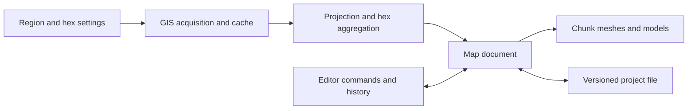

# GIS Hex Map MVP Roadmap

Build a PC-native GIS-driven 3D hexagonal map generator and visual editor using Rust and Bevy. Users select a real geographic region, configure hex spacing, automatically generate a map from real GIS data, edit it visually, and reliably save and reload their work.

Implemented functionality covers **M0–M2**, plus river integration, GIS-driven materials, urban-cell editing, adaptive display heights and persisted settings. [Validation results](validation.md) record the real GIS and macOS rendering checks. Native Windows runtime verification, clean-machine checks and release performance measurements remain acceptance gates. The research baseline is **8 October 2026**.

## Scope and constraints

- Release targets: **Windows x64 and macOS Apple Silicon**.
- Hex spacing: **1–20 km between neighboring hex centers**.
- Geographic extent: up to **1,000 km across**.
- Map size: at most **100,000 hexes**.
- These limits apply together; larger regions require larger hex spacing.
- Initial geographic support: regions within **60° south to 60° north**, without antimeridian crossings.
- GIS acquisition and processing run locally in the application. No backend is required.
- Users must not manually download, prepare, or import GIS files to generate a map.
- Generated geography must come from real datasets. Missing inputs must not be replaced with fabricated terrain.
- Combat, units, pathfinding, logistics, and other gameplay systems are outside this project scope.
- Web, WebAssembly, and browser compatibility are outside the MVP scope.

## Recommended technology stack

Use one Rust application, with ordinary modules and Bevy plugins connecting the editor and renderer to an engine-independent map document.

| Area | Recommendation | Compatibility and rationale |
| --- | --- | --- |
| Engine | **Bevy 0.19.1** | Current stable release found during research. Freeze the engine version for the MVP and commit `Cargo.lock`. [Release metadata](https://docs.rs/crate/bevy/latest) |
| Rust | **1.99.0**, pinned | Bevy 0.19.1 declares Rust 1.95 as its minimum. `rust-toolchain.toml` pins the development toolchain. [Tagged manifest](https://raw.githubusercontent.com/bevyengine/bevy/v0.19.1/Cargo.toml) |
| Editor UI | **bevy_egui 0.42.0** | Explicitly supports Bevy 0.19. Use its re-exported `egui` to avoid introducing another UI version. [Compatibility table](https://docs.rs/crate/bevy_egui/latest) |
| Hex coordinates | **hexx 0.25.0** | Supports Bevy 0.19. Enable only the coordinate, grid, and serialization functionality needed by the editor. Build continuous terrain meshes separately. [Dependencies and features](https://docs.rs/crate/hexx/latest) |
| GIS | **gdal 0.19.0**, **gdal-src 0.3.0 / GDAL 3.12.1**, bundled **PROJ 9.6.2** | Minimal static build enables GeoTIFF, shapefile, GeoJSON, memory drivers, and HTTPS range reads. Package PROJ data with the executable. Unix TLS uses vendored OpenSSL and bundled Mozilla certificate roots; Windows uses Schannel. [Version support](https://docs.rs/crate/gdal/0.19.0) |
| Geometry | **geo 0.33.1**, `spade 2.15.1`, using `geo-types` 0.7 | Polygon unions, containment, line–hex intersections and local constrained triangulation around channels. Compatible with the geometry types used by `gdal`. Keep projection through GDAL rather than adding another PROJ binding. [Manifest](https://docs.rs/crate/geo/latest/source/Cargo.toml) |
| Downloads | **ureq 3.x** | Blocking HTTP on a background worker avoids an application-wide async runtime. GDAL handles raster range reads separately. [Documentation](https://docs.rs/ureq/latest/ureq/) |
| Persistence and utilities | `serde` 1, `serde_json` 1, `tempfile` 3, `zip` 8, `anyhow` 1, `sha2` 0.10, `dirs` 6 | Exact resolved versions are in `Cargo.lock`. Use JSON initially rather than designing a binary format. |
| File dialogs | **rfd 0.17.2** | Native Windows and macOS dialogs. [Crate documentation](https://docs.rs/crate/rfd/latest) |
| Rendering and picking | Bevy PBR, mesh ray casting, automatic instancing | Avoid additional terrain, physics, or picking plugins initially. [Mesh ray casting](https://bevy.org/examples/3d-rendering/mesh-ray-cast/), [automatic instancing](https://bevy.org/examples/shaders/automatic-instancing/) |

**GDAL is the default despite its packaging cost.** A pure Rust pipeline would avoid native libraries but require validating more separate components for GeoTIFF metadata, compression, overviews, coordinate transformations, and vector formats. Prove the bundled GDAL approach early, before building the editor around it.

The `gdal` 0.19.0 documentation build currently fails on docs.rs. Validate required APIs from its released source and an actual native build in M0. Dependency metadata alone does not establish that the full application compiles or runs.

## GIS data sources and acquisition

| Data | Source | Acquisition inside the application | Licensing and limitations |
| --- | --- | --- | --- |
| Elevation | **Copernicus DEM GLO-90**, public AWS mirror | Read the tile index, identify intersecting 1° tiles, and retrieve required raster windows through anonymous HTTPS. | Free under the specific Copernicus DEM license, with attribution and notice requirements. Represents surface elevation, including vegetation and structures. [Dataset documentation](https://copernicus-dem-90m.s3.amazonaws.com/readme.html), [GLO-90 license, PDF pages 19–21](https://dataspace.copernicus.eu/sites/default/files/media/files/2025-06/copernicus_contributing_mission_data_access_v2_cop_dem_licenses.pdf) |
| Land cover | **ESA WorldCover 2021 v200**, 10 m | Discover intersecting 3° tiles and read Cloud Optimized GeoTIFFs from the public S3 bucket. | CC BY 4.0. Preserve the dataset year and required credits. Provides a dated 2021 geographic snapshot. [Access and license](https://esa-worldcover.org/en/data-access) |
| Rivers | **HydroRIVERS v1** | Download and cache relevant continental shapefile ZIPs automatically, then filter features to the selected region. | Uses the HydroSHEDS license. Commercial use is permitted, but redistribution has specific conditions. Includes rivers meeting catchment or discharge thresholds, rather than every small stream. [Dataset](https://www.hydrosheds.org/products/hydrorivers), [license appendix](https://data.hydrosheds.org/file/technical-documentation/HydroSHEDS_TechDoc_v1_4.pdf) |
| Cities | **GeoNames `cities1000.zip`** | Download the compact global archive, parse locally, and filter by region and population. Retain multiple settlements assigned to one hex. | CC BY 4.0. Includes settlements above 1,000 population and certain administrative seats; population accuracy varies. [Format and license](https://download.geonames.org/export/dump/readme.txt) |
| Region selector | **Natural Earth land outlines** | Bundle a small geographic dataset for a native overview map on which users draw a rectangle. | Public domain. Detailed terrain generation uses the sources above. [Terms](https://www.naturalearthdata.com/about/terms-of-use/) |

Sample elevation, WorldCover, HydroRIVERS, and GeoNames URLs returned **HTTP 206** without authentication and valid TIFF or ZIP signatures during planning research. These checks establish sample download access and byte-range behavior. They do not establish decoding correctness, global coverage, or service availability guarantees.

Acquisition must:

- Show estimated hex count, download size, and cache requirements before generation.
- Download continental river archives once and reuse them.
- Batch raster window reads and use appropriate overviews rather than fetching individual pixels per hex.
- Cache processed regional inputs with source identifiers and generation settings.
- Record source URLs, dataset versions, available ETags, acquisition dates, and hashes of downloaded or processed inputs.
- Provide progress, cancellation, bounded retries, and clear errors.
- Validate coverage separately from network failures.
- Publish a generated map only after every required layer succeeds.
- Permit offline editing and project loading. Offline generation requires complete cached inputs for that request.

Start with GLO-90 for the agreed hex sizes. Add GLO-30 only after evidence that finer input materially improves generated maps.

Keep raw GIS caches outside project files. Preserve required attribution, license notices, and applicable distribution conditions in generated projects. Resolve HydroRIVERS handling for portable projects in M0.

## System architecture

| Module | Responsibility |
| --- | --- |
| `map_core` | Hex coordinates, geographic metadata, terrain and feature records, generation settings, validation |
| `gis` | Dataset discovery, downloads, cache management, raster/vector reading, coordinate transformations |
| `generation` | Raster aggregation, terrain classification, river rasterization, settlement assignment |
| `rendering` | Chunk meshes, materials, environmental models, overlays, camera, terrain picking |
| `editor` | Tools, selection, edit commands, undo/redo, dirty-chunk tracking |
| `project_io` | Versioned saving/loading, atomic replacement, backups, provenance and license notices |

The **map document is authoritative**. Bevy entities, meshes, and tree/building instances are derived views. Save the map document rather than an ECS scene to avoid coupling project files to engine internals.

Use a dense collection of cells with stable integer IDs. Each cell retains:

- Generated elevation and relevant source statistics.
- Current editable elevation.
- Landscape classification: plains, forest, or mountain.
- Surface classification: land, river, or open water.
- Settlement records and other supported features.
- Whether values were generated or edited.

This separation allows a city and river to coexist in one hex without losing either record. River and open-water classifications take priority over the urban surface classification. Urban coverage and building clusters can coexist with a river cell on dry ground; source settlements stay attached to their original containing hex. Future roads can be added as another feature without restructuring the terrain model.

### Generation pipeline

1. Validate the region and count prospective cells.
2. Establish a local metric projection centered on the region.
3. Acquire inputs for the region plus a processing margin.
4. Read and cache bounded raster windows.
5. Aggregate elevation and land-cover samples into hexes.
6. Classify landscape and open water.
7. Rasterize selected rivers into complete cells.
8. Assign cities, validate the document, and publish the result.

Use **64-bit coordinates for GIS calculations**, then convert to local rendering coordinates. A local azimuthal equidistant projection is the default for bounded regions and avoids UTM-zone boundary handling. Measure scale distortion before accepting a region. [PROJ documentation](https://proj.org/en/stable/operations/projections/aeqd.html)

Retain land-cover fractions and derive mountains from **slope and local relief**, rather than elevation alone. Start with documented thresholds, calibrate against real regions, and save thresholds with each project.

Land-cover values are categorical. Use nearest-neighbor or mode processing, followed by explicit class aggregation. Averaging class numbers produces meaningless results. DEM processing can use averaging or bilinear interpolation. [GDAL resampling documentation](https://gdal.org/en/stable/programs/gdaladdo.html)

Intersect river line segments with hex polygons and include every crossed cell. Resolve exact boundary cases deterministically to preserve connected cell chains. Retain river IDs and connectivity metadata. Expose a river-importance threshold based on discharge or stream order; including every tributary at theater scale could turn much of the map into river terrain.

River classification occupies complete cells for editing and selection. Visible water follows retained GIS centerlines with symbolic width, independent of hex edges. Preserve source location and connectivity rather than claiming literal channel widths. Missing land elevation must never be interpreted as sea-level terrain. Assign sea level only where input data establish open water.

### Continuous terrain and environmental models

- Use **32 × 32-cell chunks** and a separate projected source DEM height field. Subdivide terrain within hex ownership boundaries; terrain shape follows the source field rather than cell means. Use integer coordinates in the normalized hex basis and a shared, ordered edge registry so both owners retain every boundary subdivision.
- Retain source WorldCover classes at projected samples. Blend vegetation, crop, bare ground, urban, wetland and snow/ice colors, with rock exposure driven by source slope. Blend bundled Poly Haven grass, soil, gravel and rock PBR textures using continuous GIS weights, triplanar mapping, mipmaps and multi-scale procedural variation. See [the art pipeline](art-assets.md) for sources and licenses.
- Retain HydroRIVERS polylines and downstream metadata. Derive bounded downhill water profiles and locally carved beds/banks. Refine meshes near channels; union channel, bend and source-mask lake footprints before triangulating a single water surface. Derive lake and coastal shorelines from the source open-water mask.
- Use level source-mask water interiors and finer shoreline contours. Connect complete water bodies to overlapping river profiles in the conditioning graph, so downstream adjustments update every crossing together. Compute shallow-edge gradients from the combined shoreline, with wet-bank ground coloring and shared water vertices across chunks. Water uses the refined terrain triangulation to keep shoreline shading local.
- Use globally canonical local-coordinate vertices and consistent normal sampling across chunks. Keep every rendered triangle assigned to its logical hex for selection.
- Preserve ordinary elevations with a soft compression threshold: below the threshold use `scale × h`; above it use `sign(h) × scale × threshold × (1 + ln(abs(h)/threshold))`. The base curve is continuous, differentiable and monotone, and keeps sea level fixed.
- Derive a continuous local baseline and relief field from source samples for bounded detail enhancement. Hills receive more detail gain than rugged mountain terrain; the enhancement fades near water. This metadata never replaces or smooths the authoritative DEM. Defaults are scale 1.4, threshold 1,500 m and local relief boost 0.6.
- Apply the same base curve to river and lake levels. Cache display samples so height controls update meshes, normals, models and picking immediately; save all three settings.
- Cache deduplicated hex outlines in retained Bevy line assets per chunk. Toggling outlines changes handles; it does not resample or rebuild the map. Update the cache after geometry or display-height changes, and hide subpixel outlines at very distant zoom.
- Reuse the last terrain-picking result while its world ray, map revision and display-height settings are unchanged. Camera movement, pointer movement, viewport changes and edits invalidate the result.
- Represent urban terrain at cell level. Retain all original settlement records in the containing hex, derive initial population from their sum, and generate symbolic building clusters and streets. River cells retain their hydrological identity; skip buildings on visible water.
- Generate CPU mesh data on one cancellable worker and install complete, current revisions on the main thread. Revision tags prevent stale jobs from replacing newer views.
- Reuse imported Kenney GLB mesh/material handles for trees, conifers, grass, shrubs, rocks and suburban buildings. Apply GIS-driven placement, regional density allowances and distance hiding. Git LFS stores model and texture binaries; native packages include the complete curated set. Profile before adding custom instancing or adaptive LOD.
- Self-contained snapshots include source fields, river paths, cells, display settings and provenance. General terrain tools, broader project workflow and performance gates follow in M3–M6.

HydroRIVERS is derived from approximately 500 m source hydrography; its paths can disagree with a finer DEM. Local bed conditioning preserves path coordinates while adapting the rendered terrain around them. This is a visual channel representation, with discharge-informed symbolic width and source-knot interpolation bounded to 8% of hex spacing, rather than a hydraulic simulation. [HydroRIVERS technical documentation](https://data.hydrosheds.org/file/technical-documentation/HydroRIVERS_TechDoc_v10.pdf)

## Required MVP and deferred features

| Required MVP | Explicitly deferred |
| --- | --- |
| Native Windows x64 and macOS Apple Silicon packages | Linux release packaging, Intel Mac support, web and WASM |
| Rectangle selection on a geographic overview, editable bounds, configurable hex spacing | Polygonal geographic selection, online geocoding, globe wrapping |
| Automatic real elevation, land-cover, river, and city acquisition | Additional providers, small-stream completeness, historical reconstructions |
| Plains, forests, mountains, whole-cell rivers, cities | Roads, railways, additional terrain palettes |
| Minimal open-water handling for lakes and coasts | Detailed coastlines, bathymetry, water simulation |
| Continuous terrain, smooth transitions, material blending, simple environmental models | Civilization-level art, erosion, dynamic seasons, advanced effects |
| Terrain/feature painting, elevation tools, rectangular region edits, undo/redo | Lasso selection, scripting, collaboration |
| Reliable local save/load and offline reopening | GIS export, persistent undo history, cloud storage |
| Angled camera, panning, unrestricted yaw rotation, smooth zoom | Additional camera modes |
| Chunk meshes and instanced repeated models | Adaptive mesh LOD and streaming worlds |
| Map generation and editing | Combat, units, pathfinding, logistics, and gameplay |

## Technical risks and fallback approaches

| Risk | Default response | Fallback |
| --- | --- | --- |
| GDAL packaging on two platforms | Prove a bundled build immediately, including PROJ data and HTTPS support. Users install no GIS SDK. | Use a bundled local GIS worker or utilities if in-process deployment is unreliable. Keep acquisition automatic. |
| Large raster downloads | Batch COG window reads and cache regional working rasters. [GDAL virtual filesystem documentation](https://gdal.org/en/stable/user/virtual_file_systems.html) | Download whole intersecting tiles automatically within a visible size budget. |
| Missing data or provider outages | Validate coverage separately from network failures; retry or use complete cached data. | Fail generation clearly without replacing the current map or fabricating terrain. |
| River density and disconnected rasterization | Validate connected cell chains and calibrate importance thresholds at several hex sizes. | Raise the threshold and simplify source lines while retaining source-derived locations. |
| DEM and river misalignment | Retain centerlines and topology; condition gentle water profiles and carve localized beds/banks. Validate steep valleys and junctions. | Reduce the selected river density or symbolic width; fail invalid geometry visibly. Full hydraulic simulation is deferred. |
| Chunk seams and expensive edits | Canonical boundary calculations, halo data, and revision-tagged background rebuilds | Reduce mesh subdivision and rebuild frequency while retaining continuous terrain. |
| Rendering performance | Limit environmental density, reuse assets, cull chunks, and profile actual maps. | Reduce decorative density and shadow cost before increasing architectural complexity. |
| Dataset age and licensing | Record dates, sources, transformations, and applicable terms in every project. | Keep raw caches outside project files and preserve required conditions for derived data. HydroRIVERS redistribution needs particular attention. |

## Development milestones and acceptance criteria

Each milestone leaves a buildable application and must pass its acceptance gate before dependent work starts. Use released, pinned dependency APIs for implementation and validation.

### M0 — Prove the risky integrations

**Estimated effort:** 1 week. **Dependencies:** none.

Resolve and lock the complete dependency graph. Build Windows and macOS prototypes with bundled GIS libraries. Generate a small real region containing multiple chunks; exercise all four data sources, coordinate transformation, a basic blended material, and repeated models.

**Acceptance criteria:**

- Both packaged prototypes run on machines without Rust, GDAL, Python, or AWS tools installed.
- Raster values and vector attributes decode successfully from automatically acquired inputs.
- Projection round trips differ by less than 1 m.
- The material works on Windows and Metal.
- Shared models batch as expected.
- A recorded decision resolves GIS-library packaging and HydroRIVERS project-distribution handling.

### M1 — Build deterministic GIS-to-hex generation

**Estimated effort:** 2 weeks. **Dependencies:** M0.

Implement region selection, limit validation, acquisition/cache behavior, geographic aggregation, terrain classification, river-cell generation, and city assignment. Display a simple inspectable map while rendering work develops.

**Acceptance criteria:**

- Three real test regions collectively exercise mountains, forests, rivers, cities, and coastal/open-water handling.
- Generation requires no manually supplied GIS files.
- Repeated generation from identical cached inputs and settings produces identical canonical cell data.
- Selected source river reaches produce connected cell chains.
- City coordinates fall in their assigned hexes; multiple settlements in one cell remain available.
- Sample elevations agree with an independent GDAL/QGIS reference using equivalent resampling.
- Interrupted or failed generation preserves the previously open map.

### M2 — Deliver continuous 3D rendering and camera controls

**Estimated effort:** 2 weeks. **Dependencies:** M1 and the rendering checks in M0.

Add chunk meshes, shared boundary calculations, smooth shading, material blending, river surfaces, tree/building models, selection overlays, and the angled camera.

**Acceptance criteria:**

- Adjacent cells and chunks have matching edge connectivity, positions and normals, including after a boundary elevation change. Validate the complete edge sequence, including locally inserted river/bank vertices.
- Plains, forests, mountains, rivers, and cities remain distinguishable at useful zoom levels.
- River classifications occupy dedicated cells; visible channels follow source paths through cell interiors without coating slopes or showing hex-shaped water boundaries. Bends, confluences and lake crossings have single water coverage and no internal shoreline stripes.
- The base compression curve preserves elevation order, ordinary relief survives at altitude, bounded local enhancement preserves recognizable ridges, and terrain/water/models/picking remain aligned. Original GIS elevations are unchanged.
- Urban cells have ground coverage and population-scaled building clusters; river conflicts retain hydrological identity.
- Source-based material blending distinguishes bare rock, vegetation, cropland, urban ground and snow/ice.
- Panning, 360° yaw rotation, and smooth bounded zoom work with mouse and trackpad.
- Terrain picking selects the correct cell on slopes and near chunk boundaries.
- UI interaction does not move the camera or select terrain.
- Repeated outline toggles reuse cached assets, preserve responsiveness, and pass native smoke rendering with outlines enabled.

### M3 — Make projects portable and reliable

**Estimated effort:** 1 week. **Dependencies:** M1–M2.

Implement a versioned, self-contained JSON project file containing cells, geographic metadata, generation settings, camera settings, provenance, and license notices. Write through a temporary file in the destination directory, then replace the destination safely. Retain a previous valid copy.

**Acceptance criteria:**

- Saving and reopening preserves every canonical map field.
- A Windows-created project opens on macOS and vice versa.
- Loading succeeds after deleting GIS caches and disabling networking.
- Corrupt files and unsupported schema versions produce useful errors without replacing the current document.
- Injected write failures leave the previous project readable.

### M4 — Complete the visual editor

**Estimated effort:** 2 weeks. **Dependencies:** M2–M3.

Implement terrain and river painting/erasing, city placement/removal, adjustable brush radius, elevation raise/lower/set/smooth tools, rectangular selections, and batch edits. Route mutations through commands containing before/after cell values. Group each brush stroke into one history entry and cap history memory.

**Acceptance criteria:**

- A stroke crossing chunks updates terrain and environmental models correctly.
- A region edit changes exactly the selected cells.
- Undoing at least 100 mixed commands restores the original canonical state.
- Redoing those commands restores the edited state.
- New edits after undo discard the obsolete redo branch.
- Elevation smoothing is bounded to the intended selection.
- Saving and reopening preserves the full edited result.
- Unsaved-change handling works for opening projects, generating a new map, and quitting.

### M5 — Validate the agreed map scale

**Estimated effort:** 1–2 weeks. **Dependencies:** M4.

Profile real GIS-generated maps, tune chunk rebuild scheduling and model density, and enforce resource limits before generation.

Use two initial reference machines: a Windows PC with a Ryzen 5-class CPU, RTX 2060-class GPU, and 16 GB RAM; and an Apple M1 Mac with 16 GB memory. Record exact hardware, software, settings, and test regions with benchmark results.

**Acceptance targets:**

- At 1080p with default environmental models enabled, 95th-percentile frame time is at most **16.7 ms for 10,000 cells** and **33.3 ms for 100,000 cells** during normal camera movement.
- Small brush changes appear within **200 ms**.
- Application memory stays below **4 GB**.
- Generation of a 100,000-cell map from already prepared cached inputs completes within **5 minutes**. This excludes initial downloads and preparation of continental inputs.
- Network operations have bounded timeouts; cancellation returns control within **10 seconds**.
- Over-limit requests are rejected before large downloads begin.

### M6 — Package and pass the complete user workflow

**Estimated effort:** 1 week. **Dependencies:** M5.

Produce Windows and macOS packages, finish first-run guidance and attribution views, and run release checks on clean machines.

**Acceptance criteria:**

- On each platform, a user can launch the application, select an uncached supported region, configure hex size, automatically generate a real GIS map, inspect every supported terrain/feature type, edit terrain and elevation, apply region edits, undo/redo, save, quit, and reopen the result offline.
- The workflow passes for an operational map and a theater map.
- No GIS file preparation or external developer tools are required.
- Release builds pass core geometry, generation, command-history, persistence, and packaging checks.

## Effort estimate

Allow approximately **12–16 engineer-weeks** for an experienced Rust/graphics developer, including integration contingency. Refine the estimate after M0 establishes packaging, GIS decoding, and rendering feasibility.
